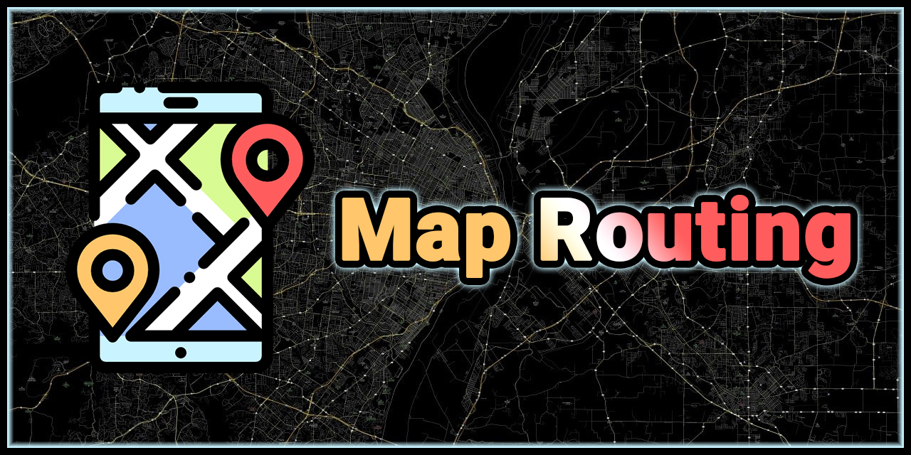

# Map Routing Project - Advanced Graph Algorithms

 <!-- Replace with actual screenshot -->

## Overview
This C++ project implements an optimized map routing system that calculates shortest paths between arbitrary points on a map with walking radius constraints. Developed for the **FCIS-ASU 2025 Analysis & Design of Algorithms** course, it features advanced graph algorithms, performance optimizations, and a fully interactive GUI.

**Key Achievements:**
- 🥇 **2nd place** among map routing projects with **131% score**
- ⚡ **Blazing fast performance**: 0.17s for medium test case, 2.6s for large test case
- 🧪 Validated against comprehensive test suites
- 🚀 Multiple advanced optimizations implemented

## Features

### Core Algorithms
- Graph construction from real-world map data
- Dijkstra's algorithm using priority queue
- Shortest path retrieval with walking radius constraints

### Performance Optimizations
- **Super Nodes** for efficient path calculation
- **AABB Collision Detection** for radius searches
- Multi-threaded query processing
- Memory-efficient data structures
- Extreme code optimization techniques

### Interactive GUI (SFML)
- Full map visualization with roads and intersections
- Zoom and pan functionality
- Custom input via mouse clicks
- Real-time path display
- Radius adjustment interface

## Performance Metrics

| Test Case        | Vertices | Edges | Queries | Execution Time |
|------------------|----------|-------|---------|----------------|
| Medium Map       | 18K      | 24K   | 200     | 0.17s          |
| Large Map        | 176K     | 180K  | 1000    | 2.6s           |

### GUI Controls
- **Left Click**: Set start position (double-click to remove)
- **Right Click**: Set destination position (double-click to remove)
- **Middle Mouse Button**: Drag map
- **Scroll Wheel**: Zoom in/out
- **Radius Textbox**: Adjust walking radius (in meters)

### Output Format
Paths are displayed in human-readable format:
```
Timestamp: YYYY-mm-DD HH:MM:SS
Start: (x, y)
Destination: (x, y)
Radius: meters
Path: intersections between start & destination
Distance: km
Distance (Walking): km
Distance (Driving): km
```

## Accomplishments Validation
- [Algorithms 2025 TOP PROJECTS](ALG_25_Term2_TOP_PROJECTS.pdf)
- [Algorithms 2025 Performance Analysis](ALG_25_Project_Evaluation_Students_Version_Map_Routing.pdf)

## Development
- This project was developed by Team 83 as part of the 2025 Algorithms course at FCIS, Ain Shams University.
- **Team 83:** [@Devil11Assassin](https://github.com/Devil11Assassin), [@Madel7](https://github.com/Madel7), [mina2442](https://github.com/mina2442), [@MohamedTarek1er](https://github.com/MohamedTarek1er), [@Mohammed-Zwam](https://github.com/Mohammed-Zwam) and [@mohammedetwally](https://github.com/mohammedetwally).
